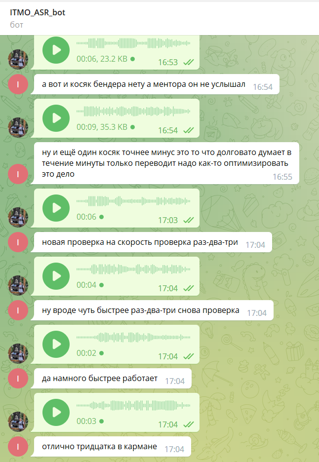

## Постановка задачи

 Необходимо создать ТГ бота для распознавания аудио сообщений и перевода их в текстовую форму. Для этого рассмотреть минимум три ASR библиотеки/метода, выбрать метрику для оценки и замерить скорость выполнения.

## Обзор возможных решений

В настоящее время задача ASR имеет большое количество реализованных методов. Мы решили рассмотреть три из них:
* предобученную Quartznet15x5 с весами от Nvidia & Сбера
* SpeechRecognition
* предобученную Vosk - одна из самых популярных

В качестве тестовых данных было записано два файла, лежащих в папке data.

* **Файл1**(data/test.wav) - четкая медленная речь. 

Содержание: *"раз два три проверка связи три два раз как слышно прием"*

* **Файл2**(data/tes2.wav) - быстрая невнятная речь. 

Содержание: *"так новая попытка попробую поговорить быстро и совершенно невнятно посмотрим как она справится с этой ерундой"*

Результаты наших экспериментов представлены ниже в таблице. Лучшие результаты выделены **жирным** шрифтом.

| №   | Название  |Время выполнения Файла1, с  | WER Файла1 | Время выполнения Файла2, с   | WER Файла2  |
|:---:|:---:      |:---:                       |:---:       |:---:                         |:---:        |
| 1   | [Quartznet15x5 #1 (Nvidia weights)](experiments/nemo_asr.ipynb) | 1.403  | **0**  | 1.003   | 0.875   |
| 2   | [Quartznet15x5 #2 (Сбер weights)](experiments/nemo_asr.ipynb)   | 1.389  | **0**  | **0.980**   | 0.875   |
| 3   | [SpeechRecognition](experiments/speech_recognition.ipynb)  | **0.621**  | 0.636  | 2.892   | 0.625   |
| 4   | [Vosk](experiments/vosk_final.ipynb) | 0.713  | **0**  | 2.701                     | **0.5625**  |

Исходя из полученных результатов для реализации в ТГ боте будем использовать библиотеку **Vosk**, так как она **лучше всего справилась с невнятной и быстрой речью**, скорость чуть меньше, **чем Quartznet15x5**, но **WER** самый высокий. С простой и четкой дикцией все, рассматриваемые библиотеки, справились на отлично. Но к сожалению, не все наши граждане, так разговаривают.

## Реализация ТГ бота

Для запуска необходимо:
1. Установить зависимости из requirements.txt
2. Скачать [веса](https://alphacephei.com/vosk/models/vosk-model-ru-0.22.zip) для русской модели, переместить их в папку **model**
или с помощью команд:

`!wget https://alphacephei.com/vosk/models/vosk-model-ru-0.22.zip`

`!unzip vosk-model-ru-0.22.zip`

`%mv vosk-model-ru-0.22 model`

4. Вставить свой собственный **token** в файле `bot.py`, при необходимости изменить путь до скаченной модели (`bot.py` запускали в колабе)
5. Запустите файл `bot.py`

Пример работы, показан ниже

## Вывод 

В результате проделанной работы было рассмотрены три библиотеки для распознавания речи, а также реализован ТГ бот.
К сожалению в рамках данной учебной работы нет возможности рассмотреть все возможные решения для задачи распознавания речи.

Для желающих рассмотреть дополнительные материалы по данной теме даны ссылки ниже:

* [Whisper - OpenAI](https://openai.com/blog/whisper/)
* [HuBERT](https://huggingface.co/docs/transformers/model_doc/hubert)
* [wav2vec](https://arxiv.org/abs/2006.11477)
* etc.
